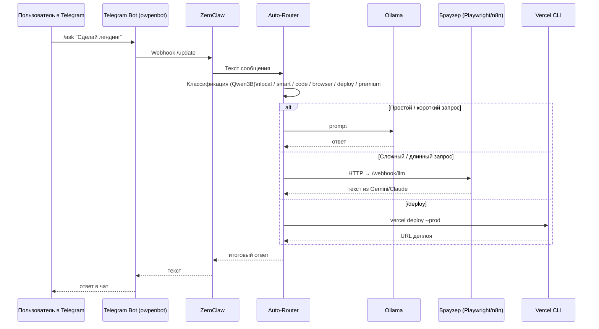
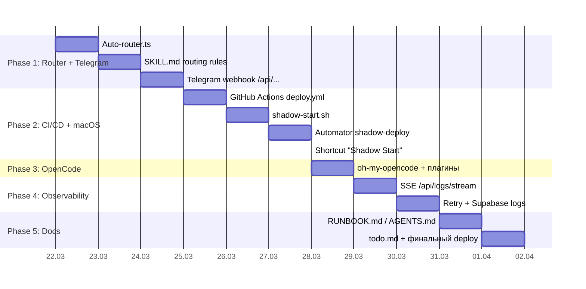

# сделай  графический план диаграму

Вот графический план Shadow Stack v3.2 в виде диаграмм (формат Mermaid, их можно вставить в Obsidian/Notion/GitHub). Схема основана на твоём гайде по Shadow Stack на Mac M1.[^1]

***

## 1. Слои архитектуры

```mermaid
flowchart TB
    subgraph ControlPlane["Control Plane"]
        TG[Telegram / owpenbot]
        ZC[ZeroClaw Gateway]
    end

    subgraph IntelligencePlane["Intelligence Plane"]
        AR[Shadow Auto-Router]
        OL[Ollama (Qwen / Phi)]
        OR[OpenRouter Free Tiers]
        BR[Browser Automation\n(Playwright MCP / n8n)]
        CLP[Claude Paid (по запросу)]
    end

    subgraph ExecutionPlane["Execution Plane"]
        VC[Vercel CLI / Deploy]
        OC[OpenCode IDE / Claude Code]
        AG[Antigravity IDE (опция)]
    end

    subgraph MacOSPlane["macOS Automation"]
        AS[AppleScript]
        AM[Automator Workflows]
        SC[Shortcuts / Shadow Start]
    end

    TG --> ZC
    ZC --> AR

    AR --> OL
    AR --> OR
    AR --> BR
    AR --> VC
    AR --> CLP

    ZC --> OC
    ZC --> AG

    VC --> AM
    AM --> AS
    SC --> AS
```


***

## 2. Поток запроса из Telegram




***

## 3. Этапы (Phase 1→5) как дорожная карта



Если хочешь, могу отдельно сделать ASCII‑карту только для ZeroClaw+Ollama+Telegram без всего остального стека.

<div align="center">⁂</div>

[^1]: Avtonomnaia-II-razrabotka-na-Mac-M1.md

