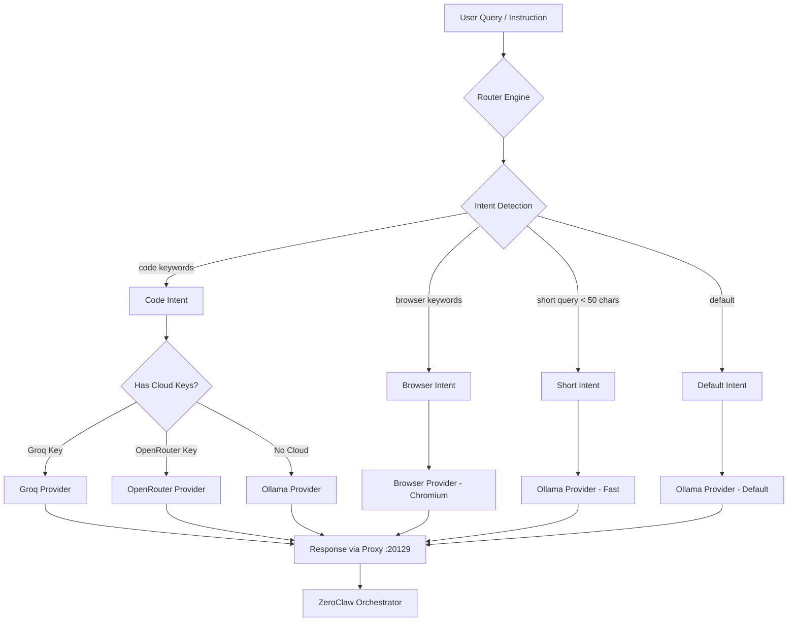
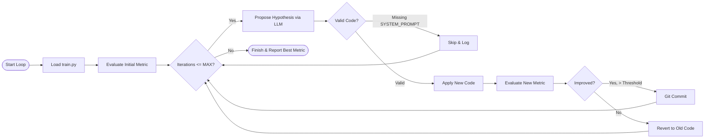
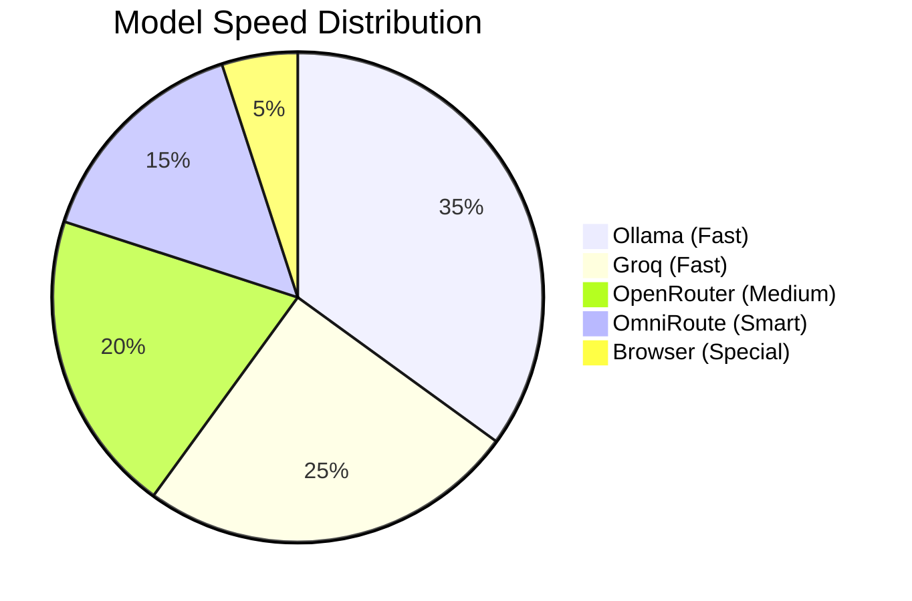
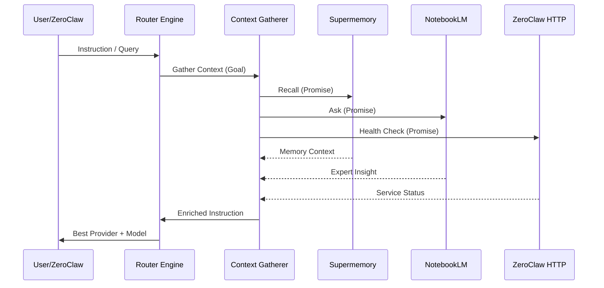

# Auto Router & Ralph Loop — Visual Architecture

## 1. Router Engine (Auto Route) Flowchart

## 2. Ralph Loop (AutoResearch) Lifecycle

## 3. Provider Speed Profiles

## 4. Context Gathering Pipeline

