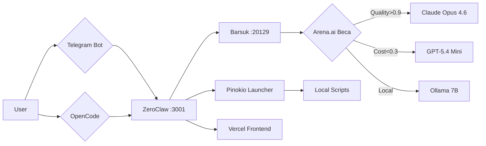

# 🔗 Интеграция Shadow Stack: Pinokio + Arena.ai

## Поток данных (5 шагов)

| Шаг | Компонент | Действие | Инструмент |
|-----|------------|----------|-----------|
| 1 | **User** | Ввод промпта | Telegram Bot / OpenCode |
| 2 | **ZeroClaw** | Оркестрация задачи | HTTP :3001 |
| 3 | **Barsuk** | Роутинг модели (Arena.ai веса) | Cascade Router :20129 |
| 4 | **Pinokio** | Локальный запуск (альтернатива pm2) | Pinokio Script |
| 5 | **Vercel** | Фронтенд (статический билд) | :5176 / Vercel CDN |

## Архитектура интеграции

## Таблица компонентов

| Компонент | Интеграция с Pinokio | Интеграция с Arena.ai |
|------------|---------------------------|----------------------------|
| **ZeroClaw** | Запуск агентов через `script.start` | Использование рейтинга для роутинга |
| **Barsuk** | — | KPI веса: `quality:0.6, cost:0.3` |
| **Cascade Router** | — | Автопереключение на основе Elo |
| **PM2** | Замена на Pinokio (Mac mini) | — |
| **Vercel** | — | Отображение рейтинга моделей |

## Улучшения для Phase 5.3

1. **Plugin Marketplace**: Использовать GitHub-based registry (как в OpenCode PR #7413).
2. **Pinokio Launcher**: Создать `.pinokio/shadow-stack.json` для 1-click запуска.
3. **Arena.ai API**: Подтягивать топ-10 моделей раз в сутки в `data/arena-ratings.json`.
4. **KPI Веса**: Внедрить `quality:0.6, cost:0.3, latency:0.1` в Cascade Router.

## Ссылки
- [[Pinokio]]
- [[Arena-AI]]
- [[Barsuk]]
- [[Cascade Router]]
- [[ZeroClaw]]
